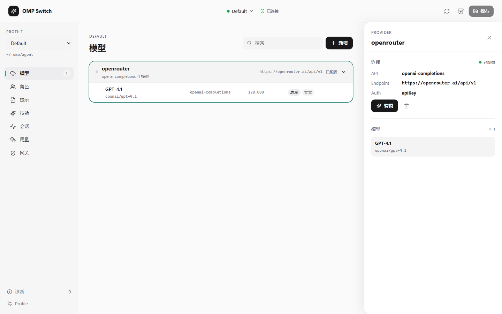
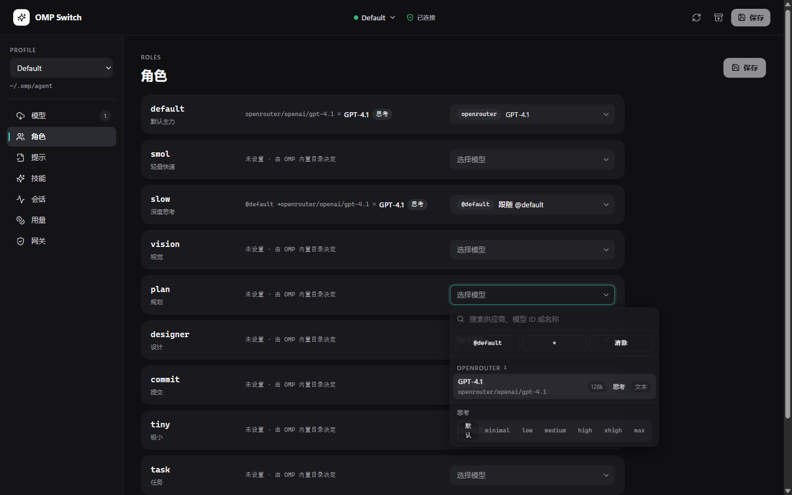

# OMP Switch

[中文](README.md) · [Install and downloads](docs/install.md) · [Features](docs/features.en.md) · [Security](docs/security.md) · [Architecture](CLAUDE.md)

OMP Switch is a desktop app for managing model providers, model roles, and related settings in [Oh My Pi](https://github.com/can1357/oh-my-pi) (OMP). It runs on Windows and Linux, and also comes as a command-line tool (CLI) and a terminal UI (TUI).

It edits files that belong to you, not to it: `~/.omp/agent/models.yml` and `config.yml`. That's why it writes carefully:

- Before writing, it checks whether another tool changed the file. If so, it stops and asks you to reload.
- It changes only what you touched. YAML comments and fields it doesn't recognize stay as they were.
- It takes a snapshot before every write, so you can always go back.
- If it meets an OMP major version it hasn't verified, it opens the files read-only.





## What's new in v0.8.0

v0.8.0 follows OMP v18.4's config format and adds provider presets informed by [CC Switch](https://github.com/farion1231/cc-switch):

- The built-in catalog grows to 81 presets, including PPIO, Kimi For Coding, 302.AI, and AIHubMix.
- Some preset models now carry context length, output limit, a reasoning flag, and a `thinkingLevelMap` (which maps OMP's thinking levels to the parameters each provider's API expects).
- The validator understands OMP 18.4's new `openrouter-decisions` and `typesafe` API types, the `apple-foundation-models` discovery source, and the `maxContextWindow`, `supportsTools`, `promptCache`, `gc.stale`, and `tools.artifactMaxBytes` fields.
- We also checked OMP v18.5.0: the `models.yml` format is unchanged, so reading and writing still work.

See the [release notes](docs/releases/v0.8.0.md) and the [CHANGELOG](CHANGELOG.md) for the full list.

> The installers are not code-signed, so Windows SmartScreen will warn you. Check what you downloaded against `SHA256SUMS.txt` and the build provenance on the release page; [docs/install.md](docs/install.md) shows how.

## Which one to get

| Form | Windows | Linux | What it does |
| --- | --- | --- | --- |
| Desktop app | Yes | Yes (AppImage / deb / rpm) | Everything: GUI, credential vault, local gateway, Prompts / Skills / Sessions |
| CLI, `omp-switch-cli` | Yes | Yes | Read and write config, validate, snapshot; stable JSON output for scripts |
| TUI, `omp-switch-tui` | Build from source | Build from source | Edit config interactively in a terminal (`pnpm build:tui`) |

The CLI and TUI don't use Electron; Node.js 24 is enough. They can't open the credential vault. An API key can only be unsealed on the machine that sealed it, so the CLI manages configuration, not secrets.

Where API keys live depends on the system:

- **Windows:** encrypted with Electron `safeStorage` (tied to your user's DPAPI key). OMP gets them back through a small C# helper.
- **Linux:** each key is its own entry in the system's libsecret keyring, and OMP gets it back through `secret-tool`. Without a Secret Service, keys fall back to an age-encrypted file. That is a real downgrade; [docs/security.md](docs/security.md) explains it.

On either system the key never goes into `models.yml`. The config holds only the command that fetches it.

## Install

Windows:

```powershell
# winget (listed; currently up to 0.7.0, 0.8.0 not yet submitted)
winget install skh2945932142.OMPSwitch

# Scoop (this repo hosts the bucket and syncs it after every release)
scoop bucket add omp-switch https://github.com/skh2945932142/omp-switch
scoop install omp-switch
```

Linux:

```bash
# Download from the Releases page, then pick one
sudo dpkg -i OMP-Switch-0.8.0-linux.deb
sudo rpm -i OMP-Switch-0.8.0-linux.rpm
chmod +x OMP-Switch-0.8.0-linux.AppImage && ./OMP-Switch-0.8.0-linux.AppImage
```

You can also download the Windows installer or portable build from [Releases](https://github.com/skh2945932142/omp-switch/releases/latest). The Chocolatey package is ready but hasn't been submitted to the official feed yet.

If you only want the CLI, use Docker:

```bash
docker run --rm -v "$HOME/.omp:/home/node/.omp" \
  ghcr.io/skh2945932142/omp-switch-cli:0.8.0 validate --profile default
```

The image is on GHCR, but GitHub makes new container packages private by default, and only the repository owner can change that in settings. If the pull says `unauthorized`, see [docs/install.md](docs/install.md#docker); a local `docker build` always works.

Checksums, provenance checks, and the other install methods are in **[docs/install.md](docs/install.md)**.

## What it does

- **Providers and models:** add, edit, and remove providers and models; set `modelProviderOrder`, `enabledModels`, `disabledProviders`, and thinking levels. Apply any of the 81 presets in one click. Model discovery works with OpenAI, Ollama, llama.cpp, LM Studio, Proxy, LiteLLM, and Apple Foundation Models.
- **Model roles:** the Roles page shows one row per role and the model it actually resolves to. `@role` cycles, bad selectors, and misuse of `:off` / `:auto` are flagged in place.
- **Preview before write:** every save first shows a line-by-line diff of `models.yml` / `config.yml`, and nothing is written until you confirm. Snapshots can be browsed and restored.
- **Also:** Prompts / Skills / Sessions browsing, usage stats, a local gateway, a Ctrl+K command palette, light and dark themes, and a Chinese / English interface.

Each page is described in [docs/features.en.md](docs/features.en.md).

## What it won't do

- It never reads or changes OMP's `agent.db`, OAuth refresh tokens, or account-rotation state.
- It never writes project-local `.omp` overrides on its own; it only reads them for reference.
- It never uploads API keys, snapshots, diagnostics, or exports.
- No cloud sync, no automatic account rotation, no downloading unknown binaries.
- API keys never go into OMP configuration. `packages/core` enforces this in the validator, so the CLI is held to it too.

See [SECURITY.md](SECURITY.md) and [docs/security.md](docs/security.md).

## Run from source

You need Node.js 24+ and pnpm 11+.

On Windows you also need the .NET SDK 10.0 and Visual Studio's "Desktop development with C++" workload, because the credential helper is published with Native AOT and needs the MSVC linker. Linux needs neither .NET nor MSVC.

```bash
pnpm install --frozen-lockfile
pnpm dev
```

If you only want the CLI, neither system needs .NET or MSVC:

```bash
pnpm install --frozen-lockfile
pnpm build:cli
node packages/cli/dist/main.js --help
```

## Checking and packaging

```bash
pnpm typecheck
pnpm test
pnpm build
pnpm package:win         # NSIS installer and portable ZIP (on Windows)
pnpm package:linux       # AppImage / deb / rpm (on Linux; install rpm first for rpmbuild)
pnpm verify:package-cli  # run the packaged JSON CLI in a temp HOME
pnpm render:packaging    # render winget / Scoop / Chocolatey manifests from real release hashes
```

Build output is local and never committed.

## Profiles and recovery

- Default profile: `~/.omp/agent/`
- Named profiles: `~/.omp/profiles/<name>/agent/`

OMP Switch honors OMP's own `PI_CONFIG_DIR`, `OMP_PROFILE`, `PI_PROFILE`, and `PI_CODING_AGENT_DIR`, so it edits the same files OMP actually reads.

A local snapshot is taken before every write. If another tool or a manual edit changed a file after it was loaded, the app stops and asks you to reload instead of overwriting it.

## Documentation

- [Features](docs/features.en.md): what each page does
- [docs/install.md](docs/install.md): every install method and the platform differences
- [docs/security.md](docs/security.md): threat model and credential handling
- [docs/pi-contract.md](docs/pi-contract.md): the agreement between OMP Switch and OMP's config files
- [docs/pi-thinking-profiles.md](docs/pi-thinking-profiles.md): thinking levels and `thinkingLevelMap`
- [docs/omp-schema-tracking.md](docs/omp-schema-tracking.md): keeping up with OMP format changes
- [docs/releasing.md](docs/releasing.md): the release process
- [CLAUDE.md](CLAUDE.md): architecture, write path, per-module invariants
- [CHANGELOG.md](CHANGELOG.md): version history
- [CONTRIBUTING.md](CONTRIBUTING.md): how to contribute

## License

[MIT License](LICENSE)
