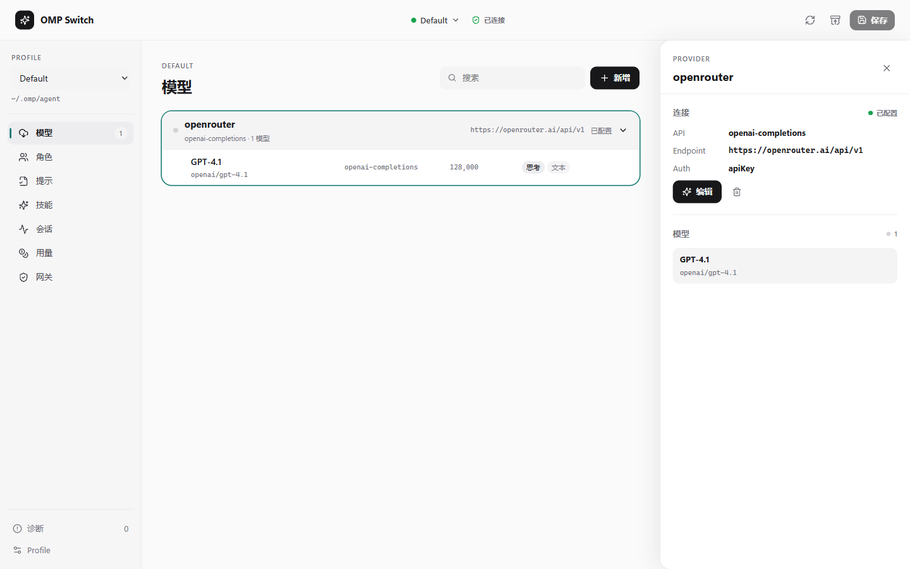
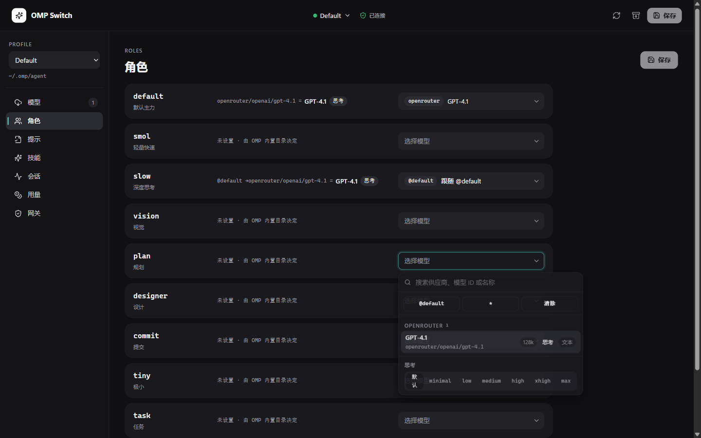

# OMP Switch

[English documentation](README.en.md) · [安装与下载](docs/install.md) · [架构说明](CLAUDE.md)

安全管理 [Oh My Pi](https://github.com/can1357/oh-my-pi)（OMP）模型供应商配置的桌面伴侣应用。

它编辑的是**你自己拥有、而它并不拥有的文件**：`~/.omp/agent/models.yml` 和 `config.yml`。整个架构都由这一点推导而来——写入前哈希校验、保留 YAML 注释与未知字段、每次提交前快照、遇到未知 OMP schema 版本转为只读。

> `v0.5.1` 已发布，见 [Releases](https://github.com/skh2945932142/omp-switch/releases)。二进制**未做代码签名**，SmartScreen 会告警；请用 `SHA256SUMS.txt` 与 build-provenance 校验。干净 Windows 的安装/升级/卸载回归尚未完成。





## 两种交付形态

| 形态 | Windows | Linux / macOS | 内容 |
| --- | --- | --- | --- |
| **桌面应用**（GUI、凭据库、网关、Prompts/Skills/Sessions） | 支持 | **暂不支持** | 全部功能 |
| **headless CLI**（`omp-switch-cli`） | 支持 | 支持 | 配置读写、校验、快照 |

桌面应用限定 Windows 是**架构原因而非打包缺失**：API key 由 Electron `safeStorage`（Windows 用户级 DPAPI）加密，OMP 需要在 GUI 关闭时通过 `native/secret-bridge`（`net10.0-windows`，调用 `crypt32.dll`）解出密钥。移植到 Linux 意味着**重新设计凭据后端**，细节与阻塞点见 [docs/install.md](docs/install.md#linux-support)。

headless CLI 完全不依赖 Electron（`packages/core` 是纯 Node），因此任何有 Node 24 的平台都能跑；它也**无法**打开凭据库——只有封装该密钥的那台机器可以。

## 安装

```powershell
scoop bucket add omp-switch https://github.com/skh2945932142/omp-switch
scoop install omp-switch
```

或直接从 [Releases](https://github.com/skh2945932142/omp-switch/releases/latest) 下载安装包 / 便携版。
winget 与 Chocolatey 清单已准备好，但**尚未提交上架**，详见 [docs/install.md](docs/install.md)。

```bash
docker run --rm -v "$HOME/.omp:/home/node/.omp" \
  ghcr.io/skh2945932142/omp-switch-cli:0.5.1 validate --profile default
```

> 镜像已推送到 GHCR，但 GitHub 默认将容器包设为私有，且可见性只能在仓库设置里切换。
> 若拉取报 `unauthorized`，见 [docs/install.md](docs/install.md#docker)（本地 `docker build` 始终可用）。

完整方式（含校验和与 provenance 验证）见 **[docs/install.md](docs/install.md)**。

## 已实现

**配置编辑**

- OMP `16.x` / `17.x` / `18.x` 可写，未知未来主版本只读。
- 默认和命名 Profile、`models.yml` / `config.yml`、旧 `models.json` 迁移保护；遵循 OMP 自己的 `PI_CONFIG_DIR` / `OMP_PROFILE` / `PI_PROFILE` / `PI_CODING_AGENT_DIR` 路径覆盖。
- Provider / Model / `modelProviderOrder` / `enabledModels` / `disabledProviders` / thinking 设置。
- YAML AST 局部修改、外部变更保护、原子写入、快照与恢复（恢复同样拒绝覆盖外部改动）。
- 54 个版本化预设；OpenAI、Ollama、llama.cpp、LM Studio、Proxy、LiteLLM discovery。

**模型角色**

- 独立「角色」页：每个角色一行——中文说明、解析链（`@default → provider/model = 实际模型`）、能力标签，`@引用` 循环、非法选择器、`:off`/`:auto` 误用就地警示；config.yml 里的自定义角色同样可见可编辑。
- 可搜索模型选择器：按供应商分组、即时过滤、置顶 `@default`/`*`/清除、思考等级分段控件（仅含 OMP 接受的六级）、完整键盘导航；网关上游同样使用。
- 模型行悬停即可一键分配到任意角色（保留原思考后缀）。

**其余模块**

- Prompts、Skills、Sessions 索引与按需原文读取；用量仪表盘（花费/请求/tokens/趋势/按模型与供应商分组，成本带来源标注）。
- Loopback Gateway：`/healthz`、`/v1/models`、Chat、Responses 与流式前故障转移；强制 Bearer token、校验 Host、拒绝跨源请求。
- Windows DPAPI 密钥桥、OMP OAuth 状态/登录入口、稳定 JSON CLI。

**界面**

- 「Quiet Instrument」视觉语言：无彩中性色、teal 仅作选中/焦点信号色、主按钮墨底白字反转、状态以圆点 + 弱文字呈现；选中行用软底而非 3px 色条，eyebrow 为句式大小写。
- 浅色 / 深色 / 跟随系统三态主题切换（持久化，原生标题栏按钮同步跟随）；中文 / English / 跟随系统三态语言切换（持久化，首屏即按存储语言绘制，无中文闪屏）；Windows 11 22H2+ 上启用 Mica 窗口材质（其余环境自动回退实色）。
- 自定义标题栏：顶栏即拖拽区，窗口按钮为原生 overlay（保留 Snap Layouts），Mica 直达顶缘。
- 供应商卡片点击头部仅展开/收起模型列表（带高度动画），悬停浮现编辑按钮；详情/编辑抽屉以悬浮 Sheet 弹簧滑入，不再挤压工作区。
- 保存语义按上下文拆分（角色 / 设置独立提交），未保存改动有导航圆点与 `Ctrl+S`；切换 Profile 前确认丢弃。
- **保存即预览**：每次写入前展示 `models.yml` / `config.yml` 的行级 diff，确认后才落盘；快照时间线可浏览与恢复历史；外部修改冲突以对话框呈现并一键重载。
- **Ctrl+K 命令面板**（页面 / Profile / 供应商 / 动作），`Ctrl+1..7` 切页，`?` 查看快捷键。
- 供应商卡片与角色选择器标注 `enabledModels` 覆盖状态，指向将被 OMP 过滤的模型会被就地提醒。

## 安全边界

- 不读取或修改 OMP 的 `agent.db`、OAuth refresh token 或账号轮换状态。
- 不自动写入项目目录中的 `.omp` 覆盖配置（只读叠加层）。
- 不把 API key、快照、诊断日志或默认导出上传到云端。
- 不做云同步、自动账号轮换或未知二进制下载。
- API key 永不进入 OMP 配置；配置里只有一条命令引用。这条规则由 `packages/core` 的校验器强制，因此 CLI 路径同样受约束。

详见 [SECURITY.md](SECURITY.md) 与 [docs/security.md](docs/security.md)。

## 从源码运行

前提：Windows 10/11、Node.js 24+、pnpm 11+、.NET SDK 10.0，以及 Visual Studio「使用 C++ 的桌面开发」工作负载（secret bridge 以 Native AOT 发布，需要 MSVC 链接器）。

```powershell
pnpm install --frozen-lockfile
pnpm dev
```

仅构建跨平台 CLI 时不需要 .NET 或 MSVC：

```bash
pnpm install --frozen-lockfile
pnpm build:cli
node packages/cli/dist/main.js --help
```

## 验证与打包

```powershell
pnpm typecheck
pnpm test
pnpm build
pnpm package:win        # -> dist/ NSIS 安装包 + portable ZIP
pnpm verify:package-cli # 在临时 HOME 中运行打包后的 JSON CLI
pnpm render:packaging   # 用真实 release 哈希渲染 winget / Scoop / Chocolatey 清单
```

打包产物是本地构建结果，不提交到 Git。

## Profile 与恢复

- 默认 Profile：`~/.omp/agent/`
- 命名 Profile：`~/.omp/profiles/<name>/agent/`

每次写入前都会创建本机快照。若检测到其他工具或手工编辑在读取后修改了文件，应用会停止写入并要求重新载入，而不是静默覆盖。

## 开发文档

- [CLAUDE.md](CLAUDE.md) — 架构、写入路径契约、各处不变量
- [docs/install.md](docs/install.md) — 所有安装方式与平台限制
- [docs/security.md](docs/security.md) — 威胁模型与凭据处理
- [docs/releasing.md](docs/releasing.md) — 发布流程
- [CHANGELOG.md](CHANGELOG.md) — 版本变更记录
- [CONTRIBUTING.md](CONTRIBUTING.md) — 贡献流程

## 许可证

[MIT License](LICENSE)
